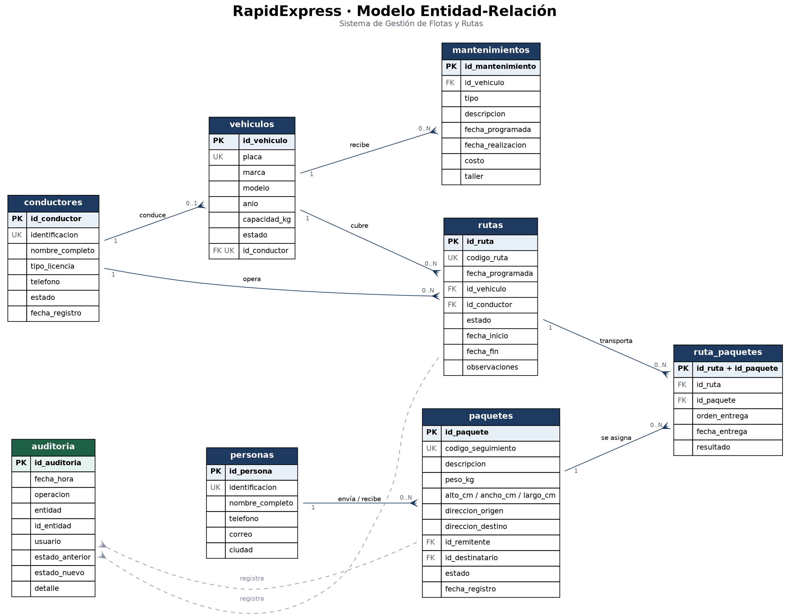

# RapidExpress · Sistema de Gestión de Flotas y Rutas

Sistema de información de backend, operado por línea de comandos, para la gestión integral de la flota de vehículos, el personal de conducción, la paquetería y la planificación de rutas de la empresa de logística RapidExpress.

---

## Tabla de contenido

- [Descripción del proyecto](#descripción-del-proyecto)
- [Tecnologías utilizadas](#tecnologías-utilizadas)
- [Diseño de la base de datos](#diseño-de-la-base-de-datos)
- [Arquitectura](#arquitectura)
- [Instalación y ejecución](#instalación-y-ejecución)
- [Guía de uso](#guía-de-uso)
- [Reportes disponibles](#reportes-disponibles)
- [Auditoría](#auditoría)
- [Estrategia de ramas](#estrategia-de-ramas)
- [Autores](#autores)

---

## Descripción del proyecto

RapidExpress creció más rápido que sus procesos. La asignación de rutas y el seguimiento de envíos dependían de hojas de cálculo y de llamadas entre los operadores de logística y los conductores, lo que producía errores de transcripción, demoras al comunicar incidencias y ninguna visibilidad del estado real de una entrega mientras estaba en curso.

Este sistema centraliza esa información en una única base de datos y expone la operación a través de una terminal. Cubre seis frentes:

1. **Flota de vehículos** — registro del parque automotor con placa, marca, modelo, año y capacidad de carga; control del estado (`DISPONIBLE`, `EN_RUTA`, `EN_MANTENIMIENTO`) e historial individual de mantenimientos preventivos y correctivos.
2. **Personal** — datos y estado de los conductores (`ACTIVO`, `EN_RUTA`, `DE_VACACIONES`, `INACTIVO`), y asignación de un conductor a un vehículo disponible.
3. **Paquetería** — registro de paquetes con código único de seguimiento, peso, dimensiones, direcciones y las personas remitente y destinataria.
4. **Rutas** — creación de hojas de ruta diarias validando que la carga asignada no supere la capacidad del vehículo, e inicio y cierre de la ruta con la actualización en cascada de los estados involucrados.
5. **Reportes** — consultas operativas sobre entregas, historial de vehículos, ocupación de rutas y desempeño de conductores.
6. **Auditoría** — bitácora de todas las operaciones críticas, escrita simultáneamente en un archivo de texto centralizado y en la base de datos.

## Tecnologías utilizadas

| Componente | Tecnología |
|---|---|
| Lenguaje | Java 17 |
| Gestor de dependencias | Apache Maven 3.8+ |
| Base de datos | MySQL 8.0 |
| Alojamiento de la BD | Instancia gestionada en la nube |
| Conector | MySQL Connector/J 8.4 |
| Interfaz | Consola (CLI) |
| Control de versiones | Git / GitHub |
| Diagramación | Graphviz |

MySQL 8 es un requisito, no una preferencia: el esquema usa restricciones `CHECK`, que MySQL 5.7 acepta en la sintaxis pero ignora silenciosamente al insertar.

## Diseño de la base de datos



El modelo tiene siete tablas operativas y una transversal de auditoría.

### Entidades y relaciones

| Relación | Cardinalidad | Regla que representa |
|---|---|---|
| `conductores` → `vehiculos` | 1 : 0..1 | Un conductor responde por un vehículo como máximo. |
| `vehiculos` → `mantenimientos` | 1 : N | Cada vehículo acumula su propio historial de taller. |
| `vehiculos` → `rutas` | 1 : N | Un vehículo cubre muchas rutas a lo largo del tiempo. |
| `conductores` → `rutas` | 1 : N | Cada hoja de ruta queda a nombre de un conductor. |
| `personas` → `paquetes` | 1 : N | La misma persona puede ser remitente de unos paquetes y destinataria de otros. |
| `rutas` ↔ `paquetes` | N : M vía `ruta_paquetes` | Una ruta lleva varios paquetes y un paquete devuelto puede reasignarse a una ruta posterior. |

### Decisiones de diseño

**La restricción "un conductor, un vehículo" vive en el motor, no en el código.** Se implementa con un índice `UNIQUE` sobre `vehiculos.id_conductor`. MySQL admite varios `NULL` en un índice único, de modo que muchos vehículos pueden quedar sin asignar, pero ningún conductor puede aparecer dos veces. Validarlo solo en Java dejaría la puerta abierta a que un `INSERT` manual rompiera la regla.

**Remitentes y destinatarios comparten la tabla `personas`.** El rol no es un atributo de la persona sino de su relación con un paquete concreto. Separarlos en dos tablas obligaría a duplicar el teléfono y la dirección de quien alguna vez envía y alguna vez recibe.

**Los datos derivados no se almacenan.** El peso total de una ruta y su porcentaje de ocupación se calculan en las vistas. Guardarlos en `rutas` introduciría una dependencia transitiva —violando la tercera forma normal— y abriría la posibilidad de que la columna quedara desincronizada de los paquetes que realmente van a bordo.

**El borrado no es uniforme y esa asimetría es intencional.** Los mantenimientos se borran en cascada con su vehículo, porque el historial de taller de una unidad que salió del parque automotor no le sirve a nadie. Las rutas usan `RESTRICT` sobre vehículo y conductor, porque una ruta ejecutada es un hecho histórico y no puede quedar huérfana. Y `auditoria` no tiene claves foráneas en absoluto: debe sobrevivir al borrado de la fila que registró.

**Estado del conductor.** El enunciado enumera tres estados pero luego exige que al iniciar una ruta el conductor pase a "En Ruta". Se añadió `EN_RUTA` como cuarto valor del `ENUM`. La alternativa —deducir la disponibilidad consultando si existe una ruta activa— obligaría a una subconsulta en cada listado de personal para responder algo que se consulta constantemente.

### Scripts

| Archivo | Contenido |
|---|---|
| `database/1_schema_ddl.sql` | Creación de la base de datos, las ocho tablas con sus restricciones, cinco vistas de reporte y cuatro procedimientos almacenados. |
| `database/2_data_dml.sql` | Datos de prueba: más de 20 registros por entidad principal, con estados coherentes entre tablas. |
| `database/diagrama_entidad_relacion.png` | Diagrama ER. |

Los datos de prueba no son aleatorios entre sí: los vehículos marcados `EN_RUTA` son exactamente los de las rutas `EN_CURSO`, y el estado de cada paquete corresponde al resultado de su asignación en `ruta_paquetes`. Un juego de datos incoherente haría que los reportes mostraran cifras imposibles en la sustentación.

## Arquitectura

El sistema aplica el patrón **Modelo-Vista-Controlador**:

```
src/main/java/com/rapidexpress/
├── Main.java                    Punto de entrada; verifica la conexión y lanza el menú
├── model/                       Entidades del dominio
│   ├── Auditoria.java
│   └── dto/                     Objetos de transferencia para los reportes
│       ├── EntregaDTO.java
│       ├── HistorialRutaDTO.java
│       └── TablaReporte.java
├── dao/                         Acceso a datos; único punto que habla SQL
│   ├── AuditoriaDAO.java
│   └── ReporteDAO.java
├── controller/                  Validación y reglas de negocio
│   ├── AuditoriaController.java
│   └── ReporteController.java
├── view/                        Interacción por consola
│   ├── MenuPrincipal.java
│   ├── ReporteView.java
│   ├── AuditoriaView.java
│   └── ConsolaUtil.java
└── util/                        Infraestructura transversal
    ├── ConexionBD.java
    └── AuditLogger.java
```

El flujo es siempre en un sentido: la vista recoge la entrada del operador y llama al controlador; el controlador valida y delega en el DAO; el DAO ejecuta la consulta y devuelve objetos. La vista nunca abre una conexión y el DAO nunca imprime en pantalla.

Los reportes agregados se resuelven con vistas y procedimientos almacenados en lugar de traer las filas crudas a Java. Contra una base de datos alojada en la nube, sumar en el cliente significa transportar por la red cientos de filas para producir un número.

## Instalación y ejecución

### 1. Clonar el repositorio

```bash
git clone https://github.com/velascodazasergio-png/RapidExpress-triada.git
cd RapidExpress-triada
```

### 2. Aprovisionar la base de datos en la nube

Cree una instancia MySQL 8.0 en el proveedor de su elección. Independientemente de cuál sea, hay dos ajustes que suelen olvidarse y bloquean la conexión:

- habilitar el acceso público a la instancia;
- autorizar su dirección IP en el grupo de seguridad o la lista de acceso.

### 3. Ejecutar los scripts

```bash
cd database
mysql -h <host> -u <usuario> -p < 1_schema_ddl.sql
mysql -h <host> -u <usuario> -p < 2_data_dml.sql
```

Cada script termina imprimiendo un conteo de lo que creó. Si alguna cifra sale en cero, algo falló antes y conviene revisar la salida completa en lugar de continuar.

### 4. Configurar las credenciales

```bash
cp src/main/resources/db.properties.example src/main/resources/db.properties
```

Edite el archivo con los datos de su instancia:

```properties
db.url=jdbc:mysql://<host>:3306/rapidexpress?useSSL=true&serverTimezone=America/Bogota
db.user=<usuario>
db.password=<contraseña>
```

`db.properties` está en `.gitignore`. Las credenciales no se suben al repositorio.

### 5. Compilar y ejecutar

```bash
mvn clean package
mvn exec:java
```

O bien, desde el artefacto generado:

```bash
java -jar target/rapidexpress-management-system-1.0.0.jar
```

## Guía de uso

Al arrancar, el sistema verifica la conexión y pide el nombre del operador. Ese nombre acompaña cada evento que se escriba en la bitácora, así que no es un trámite: es lo que hace posible responder después quién hizo qué.

```
======================================================================
                    R A P I D   E X P R E S S
          Sistema de Gestión de Flotas y Rutas · v1.0
======================================================================

Verificando conexión con la base de datos... OK

  1. Gestión de la flota de vehículos
  2. Gestión de personal (conductores)
  3. Gestión de paquetes y envíos
  4. Planificación y seguimiento de rutas
  5. Reportes operativos
  6. Auditoría del sistema
  0. Salir
```

Los menús se navegan con el número de la opción. En cualquier submenú, `0` devuelve al nivel anterior. Las fechas se ingresan en formato `aaaa-mm-dd`; una entrada mal formada se rechaza y se vuelve a pedir en lugar de propagarse hacia el controlador.

### Ejemplo: entregas de un conductor

```
Opción: 5
Opción: 1
Id del conductor: 3
Fecha inicial (aaaa-mm-dd): 2026-07-01
Fecha final (aaaa-mm-dd): 2026-09-02

 RUTA         | FECHA      | PLACA    | GUÍA           | DESTINO           | PESO KG
 RUT-2026-003 | 2026-07-15 | JPV121   | RE202600012    | Cra 33 # 45-19    |   42.80
 ...

  Total: 7 entrega(s) · 318.45 kg movilizados
```

## Reportes disponibles

Los dos primeros son los que exige el enunciado; el resto son complementarios.

| Reporte | Implementación | Entrega |
|---|---|---|
| Entregas de un conductor por rango de fechas | `sp_entregas_por_conductor` | Cada paquete entregado, con su ruta, vehículo, destino y momento de entrega, más el peso total movilizado. |
| Historial de rutas de un vehículo | `sp_historial_rutas_vehiculo` | Todas las rutas del vehículo con paquetes, peso, porcentaje de ocupación y duración, más la ocupación promedio. |
| Estado general de la flota | `v_estado_flota` | Cada vehículo con su conductor, estado, rutas acumuladas y mantenimientos pendientes. |
| Desempeño de conductores | `v_desempeno_conductores` | Rutas asignadas y finalizadas, paquetes entregados y devueltos, y porcentaje de efectividad. |
| Ocupación de rutas | `v_ocupacion_rutas` | Peso asignado frente a la capacidad del vehículo, con el avance de entregas. |
| Paquetes por estado | `v_paquetes_por_estado` | Distribución del inventario en el ciclo de vida, con pesos y participación porcentual. |
| Seguimiento de un paquete | `sp_seguimiento_paquete` | Trazabilidad completa de una guía a partir de la bitácora. |

## Auditoría

Cada operación crítica —creación de paquetes, creación, inicio y cierre de rutas, cambios de estado, asignación de conductores— se registra en dos destinos a la vez:

- **`logs/auditoria.log`**, el archivo de texto centralizado que pide el enunciado. Sobrevive a una caída de la base de datos y se lee con cualquier editor.
- **La tabla `auditoria`**, que es la que consultan los reportes, porque un archivo plano no permite filtrar por periodo ni agrupar por operación sin herramientas externas.

Ninguno de los dos reemplaza al otro.

La bitácora se escribe desde la capa de aplicación y no con triggers de base de datos. La razón es que el requisito habla de operaciones de negocio, no de sentencias: iniciar una ruta modifica cuatro tablas, y un juego de triggers lo registraría como diez eventos inconexos en lugar de uno solo llamado `INICIAR_RUTA`. El método de registro es `synchronized` porque el enunciado admite varias terminales operando en paralelo, y dos hilos escribiendo en el mismo archivo sin coordinación producen líneas entrelazadas.

Un fallo al auditar nunca interrumpe la operación de negocio: se informa por `System.err` y el flujo continúa. Perder una línea de bitácora es malo; dejar una ruta a medio iniciar porque no se pudo escribir el log es peor.

Formato de cada línea:

```
2026-09-02T07:00 | INICIAR_RUTA | RUTA | 15 | operador.logistica | PLANIFICADA -> EN_CURSO | Ruta RUT-2026-015 iniciada
```

## Estrategia de ramas

`main` se mantiene limpia y solo recibe código por fusión. El trabajo se hace en ramas de funcionalidad que se integran a `develop` y de allí a `main`.

```
main
 └── develop
      ├── feature/fleet-management
      ├── feature/packages-and-routes
      └── feature/reports-and-audit
```

Los mensajes de commit se escriben en inglés siguiendo un formato consistente:

```
feat(reports): add driver delivery report by date range
fix(audit): resolve wasNull check on nullable route duration
docs(readme): document database design decisions
```

## Autores

| Integrante | Módulos |
|---|---|
| Michael Santos | Flota de vehículos y personal de conducción |
| Nikolas | Paquetería, envíos y planificación de rutas |
| Sergio Velasco | Reportes, auditoría, modelo de datos e integración |
